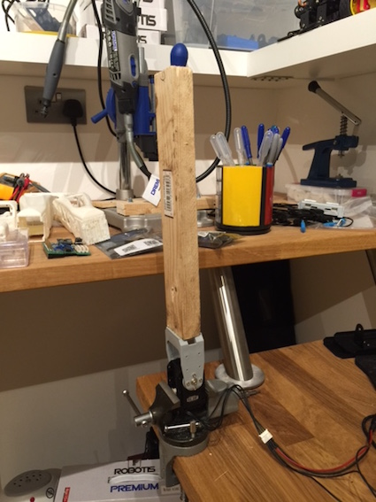

# RX-24F testing results

I have been testing the RF-24F to verious stress situations.

Here is the layout of the test harness:

The arm is aprox. 170g and has a lengh of aprox 33.5 (just the wood part). It places the center of mass aprox. 20cm from the servo horn. There is another piece of wood that can be screwed toghether to the first one increasing the mass to aprox 320g.

The names of the files represent the testing: ex. the first one idicates a testing with the 170g with 20cm arm (to CM) executed at a 3.75rpm (22.5deg/s) for 5 minutes. The file has the poistion, speed, load and temperature sampled every 0.1s.

The program moves the arm in the upright position (0 degrees) then in the horizontal position (90 degrees) then back. I've included the python program in case you're interested too.
